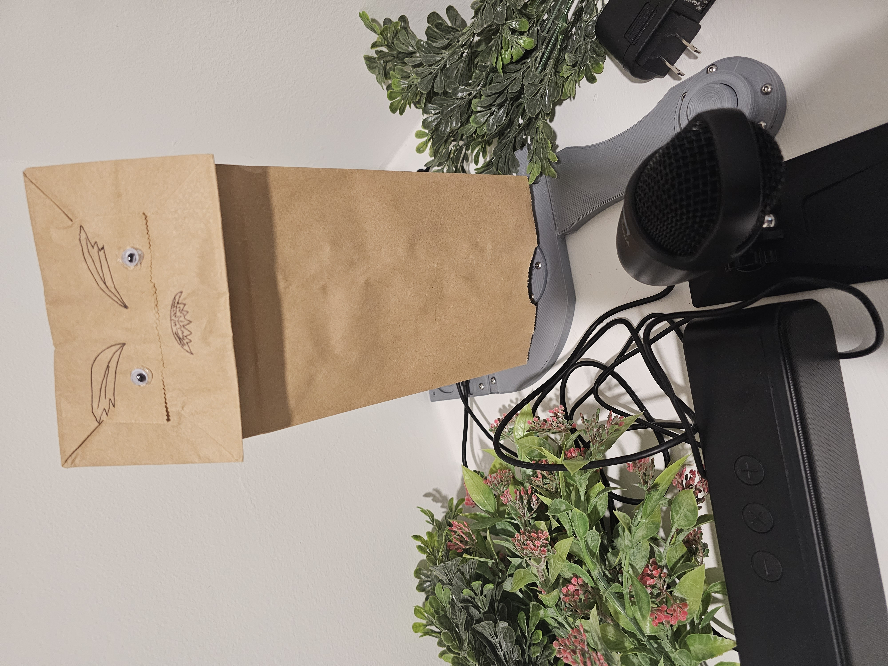
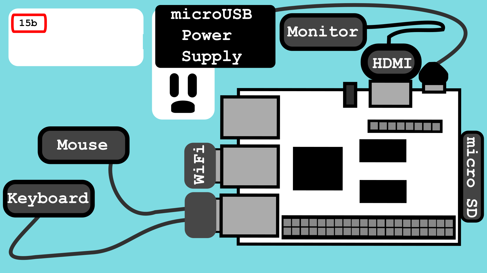

# Talking Paper Bag GPT



[Demo Link](https://www.instagram.com/p/CzWKE8drE5b/)

# Table of Contents
- [Introduction](#introduction)
- [Requirements](#requirements)
   - [Bill of Materials](#bill-of-materials)
   - [Tools Needed](#tools-needed)
- [Assembly](#assembly)
   - [Print Settings](#print-settings)
   - [Assembly and Setup Steps](#assembly-and-setup-steps)

## Introduction

This device turns any paper bag into a talking puppet! It uses OpenAI's GPT3.5 turbo as well as the Azure Speech service in order to enable communication with this paper bag.

You can also give the paper bag a personality via specifying the system message. I have a few pre-built personalities that you can use (a lot of them are problematic, though so heads up).

## Requirements

### Bill of Materials

|  Name                  | Purpose           | Amazon Link    |
|------------------------|-------------------|----------------|
| 1 Libre AML-S905X-CC   | The Brains of the system. Can run linux. Future updates may involve using MicroPython and remove the need for an OS, but this is the current design. Also has 4 USB ports, so it was easy to run USB peripherals on them. | [link](https://www.amazon.com/gp/product/B074P6BNGZ/ref=ppx_yo_dt_b_search_asin_title?ie=UTF8&th=1) |
| 1 SD Card              | This will be the non-volatile storage | [link](https://www.amazon.com/SanDisk-Extreme-microSDXC-Memory-Adapter/dp/B09X7BK27V/ref=sr_1_6?keywords=sd+card) |
| 1 Wifi Dongle          | WiFi connectivity. This board does have an Ethernet plug so you can use that and free up a USB port. I just went with this. | [link](https://www.amazon.com/gp/product/B0BNFKJPXS/ref=ppx_yo_dt_b_search_asin_title?ie=UTF8&psc=1) |
| Some Stranded Wire     | To connect everything together | [Link to the Wire I Used](https://www.amazon.com/gp/product/B077HQ779B/ref=ppx_yo_dt_b_search_asin_title?ie=UTF8&psc=1) |
| Crimp Connectors       | To make the wire connections. You could bring your own pre-made wires for this, but I just decided at one point it was cheaper to make my own. | [Link with Crimper](https://www.amazon.com/gp/product/B07VQ6YNSC/ref=ppx_yo_dt_b_search_asin_title?ie=UTF8&psc=1) |
| 1 SG90 Servo           | To move the paper bag head. | [Link](https://www.amazon.com/gp/product/B07Q6JGWNV/ref=ppx_yo_dt_b_search_asin_title?ie=UTF8&psc=1) |
| Hot Glue               | For glueing things together when needed | [Link](https://www.amazon.com/AdTech-Glue-Sticks-Full-Clear/dp/B000PCY91O/ref=sr_1_4?keywords=glue+gun+sticks) |
| M3 Screws of Various Sizes | For securing all of the 3D printed parts together | [Link](https://www.amazon.com/gp/product/B08H24W42K/ref=ppx_yo_dt_b_search_asin_title?ie=UTF8&psc=1) |
| A USB Speaker          | For hearing ChatGPT talk to you. Could go with a combined speaker/microphone.  | [Link](https://www.amazon.com/gp/product/B08QRYTPGH/ref=ppx_yo_dt_b_search_asin_title?ie=UTF8&psc=1) |
| A USB Microphone       | For talking to ChatGPT. Could go with a combined speaker/mic. Similar to the one I used. | [Link](https://www.amazon.com/Cyber-Acoustics-Premium-Condenser-Microphone/dp/B0857HD2PT/ref=sr_1_31?keywords=usb+microphone+insignia) |
| PLA Filament           | For making the full 3D-printed assembly. | [Link](https://www.amazon.com/gp/product/B08QN5FQX7/ref=ppx_yo_dt_b_search_asin_title?ie=UTF8&psc=1) |
| Some solid core wire   | For the button | [Link](https://www.amazon.com/gp/product/B081GMJVPB/ref=ppx_yo_dt_b_search_asin_title?ie=UTF8&psc=1) |
| A Push Button          | For controlling when to talk to the Paper Bag | [Link](https://www.amazon.com/gp/product/B09R47N37H/ref=ppx_yo_dt_b_search_asin_title?ie=UTF8&psc=1) |
| Paper Bags | For the whole aesthetic |  | 
| Paper Bag Decorations | For decorations |  |

### Tools Needed

|  Name                  | Purpose           | Amazon Link    |
|------------------------|-------------------|----------------|
| Wire Stripper          | Stripping Wires   | [Link](https://www.amazon.com/gp/product/B09539R6TD/ref=ppx_yo_dt_b_search_asin_title?ie=UTF8&psc=1) |
| 3D Printer             | For printing the full 3D printer assembly | [I use a modded Geeetech A10, but link to some random printer](https://www.amazon.com/Comgrow-Creality-Ender-Aluminum-220x220x250mm/dp/B07BR3F9N6/ref=sr_1_11?keywords=geeetech+a10&ufe=app_do%3Aamzn1.fos.18ed3cb5-28d5-4975-8bc7-93deae8f9840) | 
| Soldering Iron         | For soldering | [Link to Default Soldering Iron, not sponsored](https://www.amazon.com/Soldering-Digital-Welding-Portable-Electric/dp/B08R3515SF/ref=sr_1_5?keywords=soldering+iron) |
| Hot Glue Gun           | For some touch up jobs, securing wires in place, etc. | |

## Assembly

### Print Settings

I printed most parts with 15% infill and surrounded the screw holes and some weak points with 90% infill using a support block in Cura.

### Assembly and Setup Steps

#### Step 1


#### Step 2


#### Step 3


#### Step 4


#### Step 5


#### Step 6


#### Step 7


#### Step 8


#### Step 9


#### Step 10


#### Step 11a


#### Step 11b


#### Step 12


#### Step 13


#### Step 14a


#### Step 14b


#### Step 15a


#### Step 15b



#### Step 15c: Install the OS

You will now need to set up your micro SD card to hold the OS (or if you go with an eMMC, go with that). The steps for installing Raspbian onto the micro SD is [here](https://hub.libre.computer/t/raspbian-11-bullseye-for-libre-computer-boards/82).

After you install the OS, insert the micro SD into the micro SD slot (shown in step 15a). 

#### Step 15d: Set up your SSH host 

Now that you have a user account set up, make sure to set up your SSH host (just so that you don't need to have a keyboard, mouse, and monitor plugged into the Libre Computer so you can plug in your other devices. NOTE this is only needed if using USB for everything. If you use AV, then you don't necessarily have to do this step).

```bash
sudo apt install openssh-server openssh-client
```

[Reference](https://www.tecmint.com/install-openssh-server-in-linux/)

#### Step 15e: Make sure the Latest Version of Python is Installed

[Follow These Instructions](https://raspberrytips.com/install-latest-python-raspberry-pi/)

#### Step 15f: Install the Necessary Pip Packages (no dokerfile)

If using the dockerfile, skip to [Step 16](#step-16) (recommended you use docker). Follow all the steps normally, then do [Step 22: Docker](#step-22-docker)

With venv
```bash
sudo apt-get install python3-libgpiod #for the gpiod library

python3 -m pip install virtualenv --system-site-packages
python3 -m pip venv pbg-venv
source pbg-venv
pip install -r requirements.txt
```
Witout venv
```bash
pip install -r requirements.txt
```

#### Step 16


#### Step 17: Clone this repo

Clone this repo onto the Libre computer. If you have done this already, kudos. If you have not, do it now.

#### Step 18: Create the cloud resources

[Create a Microsoft Azure Account](https://azure.microsoft.com/en-us/free/)

[Create an Azure subscription or Use an Existing One](https://learn.microsoft.com/en-us/azure/cost-management-billing/manage/create-subscription)
[How to Install and Configure Terraorm for Microsoft Azure](https://learn.microsoft.com/en-us/azure/developer/terraform/quickstart-configure)

Once there is an Azure subscription, terraform is set up, and "az login" or the equivalent command has been run, then it's time to set up the resource groups and the speech/other resources needed.
```bash
#for creating the service account used (make sure to get the account information from this)
cd terraform_code/accounts
terraform init
terraform apply
#for the resource group
cd terraform_code/resource_group
terraform init
terraform apply
```
Then update the settings.yaml file (in the terraform_code directory) with your desired allowed IP addresses that should access your key vault (needs to be the public IP(s) that the Libre Computer is going to connect to). Specify the CIDR and the IP address.

```bash
#for the actual azure resources
cd terraform_code/speech2text
#this terraform will use the settings.yaml file.
terraform init
terraform apply
```

Verify the resources exist:
Look under "resource groups" on portal.azure.com and find the correct resource group known as rg-sbt-ai. Then click on it and make sure the speech resource and the key vault are there


#### Step 19: Get the Azure speech API key

Go to the Azure speech resource named cog-acc-speech-sbt-ai and go down to where it says "KEYS". Use any one of those keys


#### Step 20: Get the OpenAI API key

Now got and set up an account with OpenAI. Once done, go to "View API Keys" and "Create a new secret key". This is the key that you will use in step 20 when inserting it into the settings.py file.


#### Step 21: Define the settings file

On the Libre Computer clone of this repo in the file named "settings.py", fill out your values. Each value in the settings.py has an explanation where to pull each value from.

#### Step 22: Run it on the Libre Computer! (no docker)

```bash
python main.py
```

#### Step 22: Docker

If running in docker, then:

```bash
#go into the cloned repo's code where the dockerfile is
sudo docker image build -t paper-bag-gpt:0.0.1 .
#run container (need privileged or to map all expected devices/volumes to the container for GPIO and USB)
sudo docker container run --privileged -d paper-bag-gpt:0.0.1 
```
Once docker is up and running, then you should have a working container!
